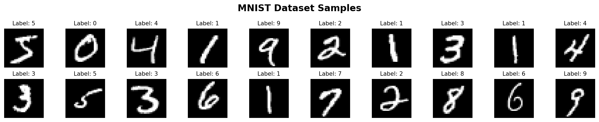
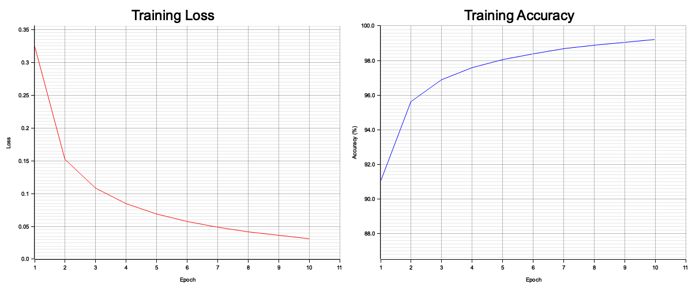

# MNIST Neural Network in Rust 🦀

A fun side project where I built a neural network from scratch in Rust to recognize handwritten digits!

## What is this?

Just a simple 3-layer neural network that learns to read handwritten digits (0-9) from the famous MNIST dataset. No fancy ML libraries - everything coded from scratch!

```shell
Input (784) → Hidden (128) → Output (10)
```

Gets around **~97% accuracy**, which is pretty cool for something built from the ground up.

## The Data

MNIST is a classic dataset with 70,000 images of handwritten digits:
- 60,000 for training
- 10,000 for testing
- Each image is 28×28 pixels

### What the digits look like



Pretty straightforward - just grayscale images of people's handwriting.

Want to see more? Run: `python3 visualize_mnist.py`

[More about MNIST →](https://en.wikipedia.org/wiki/MNIST_database)

## How it works

Basic neural network stuff:

```rust
// Push data through the network
hidden = relu(input · weights1 + bias1)
output = softmax(hidden · weights2 + bias2)

// Learn from mistakes (backpropagation)
// Update weights to get better predictions
```

Training setup:
- 10 epochs
- Learning rate: 0.1
- Batch size: 32
- Cross-entropy loss

## Results

### Training Progress



The network learns pretty quickly! Loss drops fast in the first few epochs, then gradually improves.

```
Epoch 1:  91% accuracy (not bad for random start!)
Epoch 5:  98% accuracy
Epoch 10: 99% accuracy on training data

Final test: 97.5% on unseen digits
```

So it correctly identifies about 9,750 out of 10,000 handwritten digits it's never seen before.

## Getting Started

### Train the Model

```bash
# Download MNIST dataset
./download_mnist.sh

# Train the model
cargo run --release
```

After training, the model will be saved to the `model/` directory.

## The Code

Super simple structure:

```rust
// Load data
let train_data = load_mnist_data("train")?;

// Make a neural network
let mut nn = NeuralNetwork::new(784, 128, 10);

// Train it
nn.train(train_data, epochs=10);

// Test it
nn.test(test_data);
```
