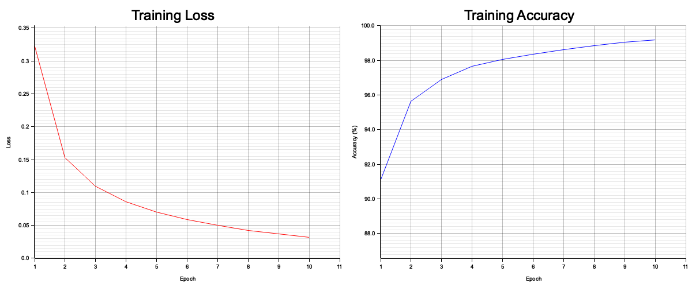

# MNIST Neural Network in Rust

3-layer neural network trained on MNIST handwritten digit classification, built from scratch in Rust.

## Model Details

- **Architecture:** Input (784) → Hidden (128, ReLU) → Output (10, Softmax)
- **Training:** 10 epochs, learning rate 0.1, batch size 32, cross-entropy loss
- **Accuracy:** ~97.5% on test set

## Training Data

MNIST dataset — 60,000 training images, 10,000 test images of 28×28 grayscale handwritten digits.

## Results

```
Epoch 1:  ~91% accuracy
Epoch 5:  ~98% accuracy
Epoch 10: ~99% train / 97.5% test
```



## Usage

```bash
./download_mnist.sh
cargo run --release
```

## Source

[GitHub →](https://github.com/supakorn/mnist-rust)
